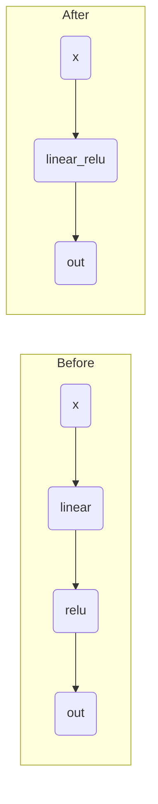
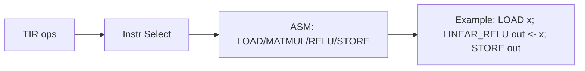
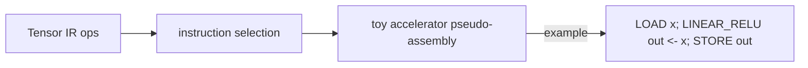

# FX2Accel — a mini ML accelerator compiler

FX2Accel is a compact, educational ML compiler pipeline that captures PyTorch models
via FX, lowers to simple intermediate representations, runs a small set of
optimizations, performs basic memory planning, and emits both a NumPy-executable
Tensor IR and a toy accelerator instruction stream.

Why this project matters
------------------------
Modern ML systems rely on compiler toolchains to map high-level models onto
specialized accelerators and runtime stacks. FX2Accel demonstrates the core
building blocks of such toolchains in a small, readable codebase:

- capturing model structure with PyTorch FX and shape propagation
- lowering into a Graph IR and a Tensor IR
- lightweight optimization passes (metadata-driven fusion, dead-code elimination)
- simple memory planning and buffer reuse
- backend codegen: NumPy execution for validation and a toy accelerator emitter

This repo is useful for learning about ML compiler design, experimenting with
fusion and memory strategies, and prototyping accelerator backends.

Compiler pipeline
-----------------
This guided walkthrough contains a set of concise, GitHub-friendly Mermaid
diagrams that explain the pipeline, key optimizations, memory planning
principles, parameter-aware lowering, and the repository layout. Each
subsection includes a short technical caption explaining why the diagram
matters for ML compiler design and accelerator SDKs.

1) Pipeline overview
```mermaid
flowchart LR
	subgraph Capture
		A[PyTorch] --> B[FX Capture]
		B --> C[ShapeProp]
	end

	subgraph Lowering
		C --> D[Graph IR]
		D --> E[Passes]\n(DCE + Fusion)
		E --> F[Tensor IR]
	end

	subgraph Backends
		F --> G[Memory Planner]
		G --> H[NumPy]
		G --> I[Accel Codegen]
	end
```
Caption: Shows where capture, lowering, passes, and backend work happen; the
subgraph grouping clarifies stages and where invariants (shapes, params,
lifetimes) are produced or consumed.

2) Graph optimization: before / after fusion

Caption: Collapsing a linear->relu chain into `linear_relu` reduces op
count and enables fused kernels on accelerators.

3) Memory planning & buffer reuse (lifetime view)
```mermaid
flowchart LR
	%% timeline-like, intentionally simple for GitHub
	L0[lin\nstart:0 end:0] --> L1[lin_relu\nstart:1 end:1] --> L2[out\nstart:2 end:2]
	note right of L1: reuse buffer0 (lin -> lin_relu)
```
Caption: Lifetime analysis results allow the planner to reuse buffers when
live ranges do not overlap, reducing peak memory on-device.

4) Backend codegen flow (instruction selection example)

Caption: Instruction selection maps Tensor IR ops to low-level sequences
that an accelerator backend can schedule or emit.

5) Parameter-aware lowering & validation
```mermaid
flowchart LR
	PM[PyTorch Params] --> FX[FX / Graph IR\n(metadata)]
	FX --> TIR[Tensor IR\n(attributes: weight,bias,dtype)]
	TIR --> NP[NumPy Backend\n(execute)]
	NP --> CMP[Compare vs PyTorch]
```
Caption: Parameters (weights, bias, dtype) are extracted into IR attributes
during lowering so backends can execute numerically-equivalent kernels and
validate outputs against PyTorch.

6) Repository map
```mermaid
flowchart TB
	subgraph repo[FX2Accel]
		FE[frontend]\n(Capture & Shape) --> IR[ir]\nIR --> PASS[passes]\nPASS --> LOW[lowering]\nLOW --> MEM[memory]\nMEM --> BACK[backend]\nBACK --> MODELS[models]\nMODELS --> TESTS[tests]\n+    UTIL[utils]
	end
	click FE "frontend/" "Frontend: FX capture and ShapeProp"
	click IR "ir/" "IR data structures"
	click PASS "passes/" "Optimization passes"
	click LOW "lowering/" "Lowering logic"
	click MEM "memory/" "Memory planner"
	click BACK "backend/" "Backends (NumPy, accel)"
	click MODELS "models/" "Example models"
	click TESTS "tests/" "Test suite"
	click UTIL "src/utils" "Utilities"
```
Caption: High-level map of repository folders and their roles; useful when
exploring where to extend lowering, add passes, or implement new backends.

Standalone diagram files are available under `docs/` for editing or
embedding in other docs sites. See `docs/*.mmd`.
```

PyTorch vs NumPy backend comparison:

```
PyTorch output shape: (1, 4)
NumPy backend output shape: (1, 4)
Max abs difference between PyTorch and NumPy backend: 0.0
```

How to run
----------
1. Create a Python environment and install requirements:

```sh
python3 -m pip install -r requirements.txt
```

2. Run the demo pipeline (prints IRs, planner, instructions, and comparison):

```sh
python3 main.py
```

3. Run tests:

```sh
python3 -m pytest -q
```

Current limitations
-------------------
- Narrow operator support: only a few ops (Linear, ReLU) are parameter-aware.
- Toy accelerator: instruction stream is illustrative and not executable on real hardware.
- Simple memory planner: first-fit reuse and simple peak estimation.
- Conservative fusion heuristics: safe but limited set of patterns.

Future work
-----------
- Add Conv2d/BatchNorm parameter extraction and lowering
- Broaden fusion patterns and use operator/type metadata robustly
- Replace heuristic allocator with a cost-based memory scheduler
- Emit real accelerator code or export to an external runtime/SDK

Visual Compiler Walkthrough
---------------------------
This section provides compact, GitHub-friendly Mermaid diagrams that
visualize the core compiler stages and decisions. Each diagram includes a
short caption explaining why the view matters for ML compilers and
accelerator SDKs.

Pipeline overview
~~~~~~~~~~~~~~~~~
```mermaid
flowchart LR
	A[PyTorch Model] --> B[FX Graph Capture]
	B --> C[Shape Propagation]
	C --> D[Graph IR]
	D --> E[Optimization Passes]\n(DCE + Op Fusion)
	E --> F[Tensor IR]
	F --> G[Memory Planning]
	G --> H[NumPy Backend]
	G --> I[Toy Accelerator Codegen]
```
Caption: End-to-end flow from high-level PyTorch model capture through IR
lowering, passes, and backend codegen — useful for understanding where
invariants (shapes, params, lifetimes) are maintained or transformed.

Graph optimization (before / after fusion)
~~~~~~~~~~~~~~~~~~~~~~~~~~~~~~~~~~~~~~~~~~

Caption: Fusion collapses a linear -> relu chain into a single fused op,
reducing IR size and opening opportunities for combined kernels on
accelerators.

Memory planning / buffer reuse
~~~~~~~~~~~~~~~~~~~~~~~~~~~~~
```mermaid
flowchart LR
	%% Simple lifetime / reuse depiction
	lin[lin\n(lifetime: t0)]
	linrelu[linear_relu_fused\n(lifetime: t1)]
	out[ out\n(lifetime: t2)]

	lin --> linrelu --> out
	note right of linrelu: reuse buffer0 (lin -> lin_relu)
```
Caption: The planner computes lifetimes and can reuse buffers when lifetimes
do not overlap, lowering peak memory needs on constrained devices.

Backend codegen flow
~~~~~~~~~~~~~~~~~~~~

Caption: Backend lowering translates Tensor IR into low-level instructions
that would be scheduled or emitted for an accelerator (here shown as
illustrative LOAD/MATMUL/RELU/STORE/LINEAR_RELU).

Standalone diagram files
------------------------
For convenience each diagram is also available as a standalone Mermaid file
under `docs/` so the visuals can be edited independently:

- `docs/pipeline.mmd`
- `docs/fusion.mmd`
- `docs/memory.mmd`
- `docs/backend_codegen.mmd`

Contributing & license
----------------------
This repository is intended as an educational prototype. Contributions are
welcome — please open issues or PRs for new lowering rules, passes, or
backend targets.

