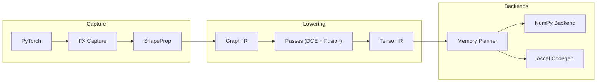
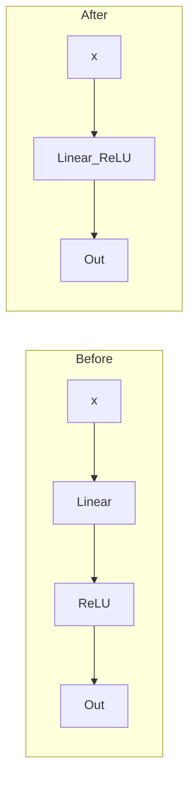
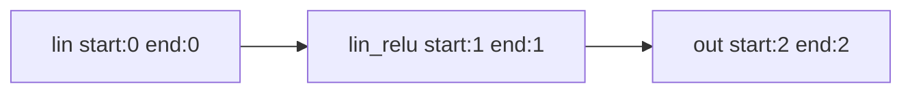
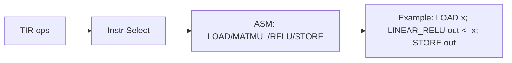
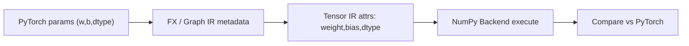
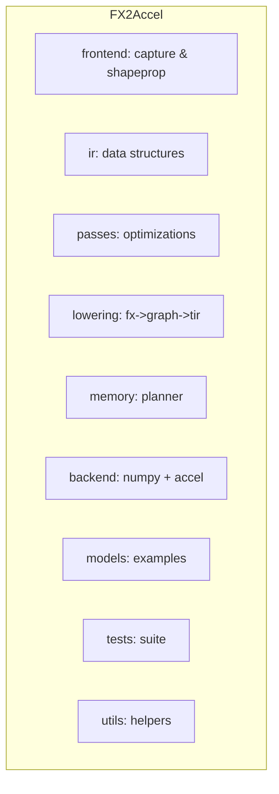

# FX2Accel — a mini ML accelerator compiler

FX2Accel is a compact, educational ML compiler pipeline that captures PyTorch models
via FX, lowers to simple intermediate representations, runs a small set of
optimizations, performs basic memory planning, and emits both a NumPy-executable
Tensor IR and a toy accelerator instruction stream.

Why this project matters
------------------------
Modern ML systems rely on compiler toolchains to map high-level models onto
specialized accelerators and runtime stacks. FX2Accel demonstrates the core
building blocks of such toolchains in a small, readable codebase:

- capturing model structure with PyTorch FX and shape propagation
- lowering into a Graph IR and a Tensor IR
- lightweight optimization passes (metadata-driven fusion, dead-code elimination)
- simple memory planning and buffer reuse
- backend codegen: NumPy execution for validation and a toy accelerator emitter

This repo is useful for learning about ML compiler design, experimenting with
fusion and memory strategies, and prototyping accelerator backends.

Compiler pipeline
-----------------
This guided walkthrough contains a set of concise, GitHub-friendly Mermaid
diagrams that explain the pipeline, key optimizations, memory planning
principles, parameter-aware lowering, and the repository layout. Each
subsection includes a short technical caption explaining why the diagram
matters for ML compiler design and accelerator SDKs.

1) Pipeline overview

Caption: Shows where capture, lowering, passes, and backend work happen; the
subgraph grouping clarifies stages and where invariants (shapes, params,
lifetimes) are produced or consumed.

2) Graph optimization: before / after fusion

Caption: Collapsing a Linear->ReLU chain into `Linear_ReLU` reduces op
count and enables fused kernels on accelerators.

3) Memory planning & buffer reuse (lifetime view)

Caption: Lifetime analysis results allow the planner to reuse buffers when
live ranges do not overlap, reducing peak memory on-device.

4) Backend codegen flow (instruction selection example)

Caption: Instruction selection maps Tensor IR ops to low-level sequences
that an accelerator backend can schedule or emit.

5) Parameter-aware lowering & validation

Caption: Parameters (weights, bias, dtype) are extracted into IR attributes
during lowering so backends can execute numerically-equivalent kernels and
validate outputs against PyTorch.

6) Repository map

Caption: High-level map of repository folders and their roles; useful when
exploring where to extend lowering, add passes, or implement new backends.

Standalone diagram files are available under `docs/` for editing or
embedding in other docs sites. See `docs/*.mmd`.
```

PyTorch vs NumPy backend comparison:

```
PyTorch output shape: (1, 4)
NumPy backend output shape: (1, 4)
Max abs difference between PyTorch and NumPy backend: 0.0
```

How to run
----------
1. Create a Python environment and install requirements:

```sh
python3 -m pip install -r requirements.txt
```

2. Run the demo pipeline (prints IRs, planner, instructions, and comparison):

```sh
python3 main.py
```

3. Run tests:

```sh
python3 -m pytest -q
```

Current limitations
-------------------
- Narrow operator support: only a few ops (Linear, ReLU) are parameter-aware.
- Toy accelerator: instruction stream is illustrative and not executable on real hardware.
- Simple memory planner: first-fit reuse and simple peak estimation.
- Conservative fusion heuristics: safe but limited set of patterns.

Future work
-----------
- Add Conv2d/BatchNorm parameter extraction and lowering
- Broaden fusion patterns and use operator/type metadata robustly
- Replace heuristic allocator with a cost-based memory scheduler
- Emit real accelerator code or export to an external runtime/SDK

-Contributing & license
----------------------
This repository is intended as an educational prototype. Contributions are
welcome — please open issues or PRs for new lowering rules, passes, or
backend targets.

